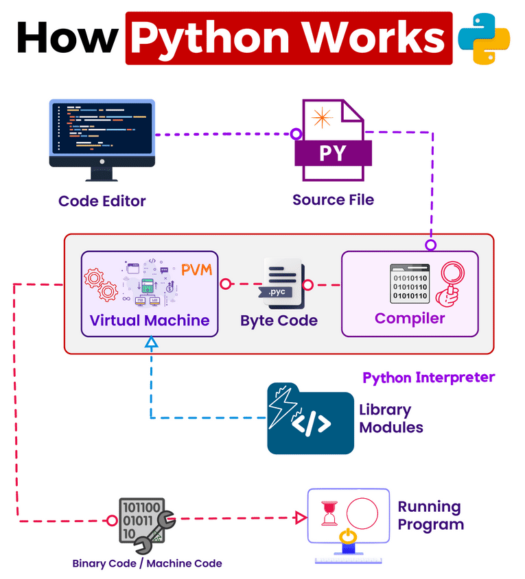

# Python Expert 

## Defination : `Python is an interpreted, object-oriented, high-level programming language. `

## Future Scope :-

* Enhanced AI and Machine Learning Capabilities
* Better Integration with Hardware and IoT Devices
* Continued Growth in Web Development Frameworks
* Expansion in Data Science and Analytics Tools
* Enhanced Security Features
* Continued Collaboration and Contribution to Open Source  Projects
* Better Support for Mobile App Development1

## Python Features :-

* Simple and Easy to Learn Syntax
* Interpreted Language
* High-Level Language
* Dynamic Typing
* Strongly Typed
* Cross-Platform
* Extensive Standard Library
* Support for Multiple Programming Paradigms
* Community Support
* Open Source
* Large Ecosystem of Third-Party Libraries and Frameworks
* Robust Error Handling
* Automatic Memory Management

## Pros :
`Readable and Clean Syntax :` Python's syntax is clear and readable, making it easier to write and maintain code. 

`Large Standard Library` : Python comes with a vast standard library that provides modules and packages for various tasks, reducing the need for external dependencies and speeding up development.

`Versatility` : Python is a versatile language that supports multiple programming paradigms, including procedural, object-oriented, and functional programming.

`Community and Ecosystem` : Python has a vibrant and active community of developers who contribute to its ecosystem by creating libraries, frameworks, and tools. 

`Cross-Platform Compatibility` : Python code can run on different operating systems without modification, making it suitable for developing cross-platform applications.

`Easy Integration` : Python can easily integrate with other languages and systems.

`Support for Web Development` : Python has robust frameworks like Django and Flask for web development, making it a popular choice for building web applications.

`Data Science and Machine Learning` : Python is widely used in data science and machine learning due to libraries like NumPy, pandas, scikit-learn, TensorFlow, and PyTorch, which provide powerful tools for data analysis and machine learning.

## Cons :
`Performance` : Compared to lower-level languages like C or C++, Python may suffer from performance limitations, particularly in CPU-bound tasks.

`Global Interpreter Lock (GIL)` : Python's Global Interpreter Lock can limit concurrency in multi-threaded applications, impacting performance in certain scenarios.

`Mobile App Development` : While Python can be used for mobile app development with frameworks like Kivy or PyQT, it's not as widely adopted in this domain compared to languages like Java or Swift.

`Runtime Errors` : Python's dynamic typing and lack of compile-time checks can lead to runtime errors that might be caught earlier in statically typed languages.

`Performance Optimization` : While Python offers performance optimization tools like Cython, optimizing performance-critical code can require additional effort compared to languages like C or C++.

`Not Ideal for Low-Level Systems Programming` : Python's high-level abstractions make it less suitable for low-level systems programming tasks that require fine-grained control over hardware resources.

 

# => Execution of Python program

 

# Python Setup

##   Download [pythonIDLE](https://www.python.org/downloads/) 
`NOTE: not forget to check env path setup while installing idle`

 

# Topics 
- Beginner Level:
    1. Installing Python
    2. Basic syntax and data types (integers, floats, strings, booleans)
    3. Variables , keywords and Basic input/output
    4. Operators
    5. Conditional statements (if, elif, else) 
    6. Loops (for , while )
    7. Lists, tuples, set, and dictionaries
    8. Functions (Types of functions)
    9. Recursion
    10. Modules and importing
    11. Exception handling (try-except)
    12. File handling (reading and writing files)
   

- Intermediate Level:
    1. Basic understanding of Object-Oriented 
    2. Programming  (OOP) concepts (classes, objects)
    3. More advanced OOP concepts (inheritance,   polymorphism, encapsulation)
    4. Advanced topics in OOP (metaprogramming, descriptors)
    1. Advanced data types (sets, frozensets)
    2. List comprehensions
    3. Generators and iterators
    4. Decorators
    5. Context managers (with statement)
    6. String manipulation and formatting
    7. Regular expressions (re module)
    8. Functional programming concepts (map, filter,  lambda functions)
    9. Debugging techniques and tools
        * Unit testing (unittest, pytest)
    10. Package management (pip, virtual environments)
    12. DataBases
        * Working with databases (`MYSQL`)
   
- Advanced Level:
    1. Concurrency and parallelism (threading,     multiprocessing, asyncio)
    2. Asynchronous programming (async/await)
    3. Performance optimization techniques (profiling, Cython, Numba)
    4. Data analysis and manipulation libraries (NumPy, pandas)
    5. Introduction to data visualization (matplotlib, seaborn)

